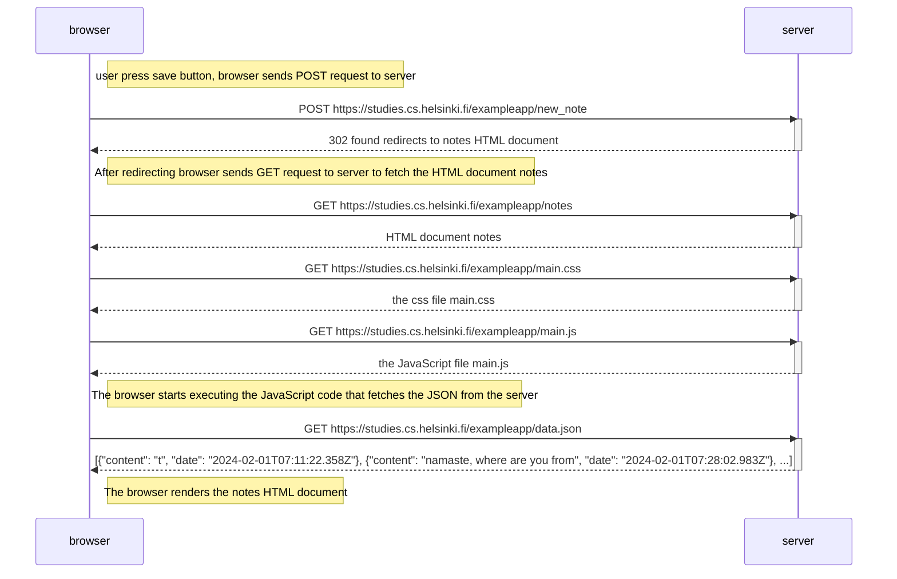

# 0.4: uusi muistiinpano

```mermaid
sequenceDiagram
    participant browser
    participant server

    Note right of browser: user press save button, browser sends POST request to server 
    browser->>server: POST https://studies.cs.helsinki.fi/exampleapp/new_note
    activate server
    server-->>browser: 302 found redirects to notes HTML document
    deactivate server

    Note right of browser: After redirecting browser sends GET request to server to fetch the HTML document notes
    browser->>server: GET https://studies.cs.helsinki.fi/exampleapp/notes
    activate server
    server-->>browser: HTML document notes
    deactivate server

    browser->>server: GET https://studies.cs.helsinki.fi/exampleapp/main.css
    activate server
    server-->>browser: the css file main.css
    deactivate server

    browser->>server: GET https://studies.cs.helsinki.fi/exampleapp/main.js
    activate server
    server-->>browser: the JavaScript file main.js
    deactivate server

    Note right of browser: The browser starts executing the JavaScript code that fetches the JSON from the server
    
    browser->>server: GET https://studies.cs.helsinki.fi/exampleapp/data.json
    activate server
    server-->>browser: [{"content": "t", "date": "2024-02-01T07:11:22.358Z"}, {"content": "namaste, where are you from", "date": "2024-02-01T07:28:02.983Z"}, ...]
    deactivate server    

    Note right of browser: The browser renders the notes HTML document
```