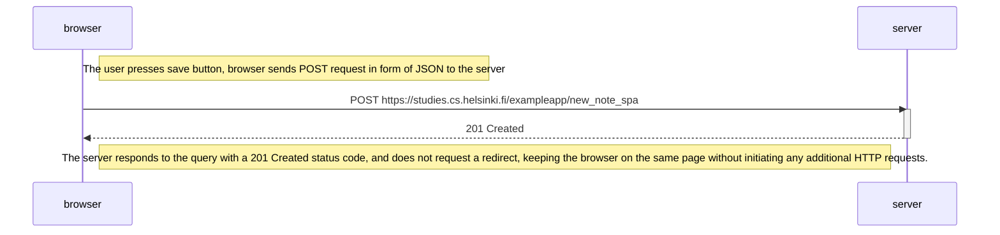

# 0.6: Uusi muistiinpano

```mermaid
sequenceDiagram
    participant browser
    participant server

    Note right of browser: The user presses save button, browser sends POST request in form of JSON to the  server 
    browser->>server: POST https://studies.cs.helsinki.fi/exampleapp/new_note_spa
    activate server
    server-->>browser: 201 Created
    deactivate server

    Note right of browser: The server responds to the query with a 201 Created status code, and does not request a redirect, keeping the browser on the same page without initiating any additional HTTP requests.
```